# miniProject-selectShop

Spring Boot 기반의 상품 선택 및 주문 미니 프로젝트입니다.

# 프로젝트 소개
- 상품 등록 및 조회 기능
- 상품 주문 기능
- JPA를 활용한 데이터 베이스 연동
- 주문 조회 및 전체 조회 페이징
- 전체 주문 시 N+1 문제 해결
- Stock(재고) 차감
- 동시 Stock(재고) 차감 시 문제 해결

# 기술 스택
- Java 17
- Spring Boot
- Spring Data JPA
- Gradle
- MySQL

# 기능 구현
    상품 등록 기능
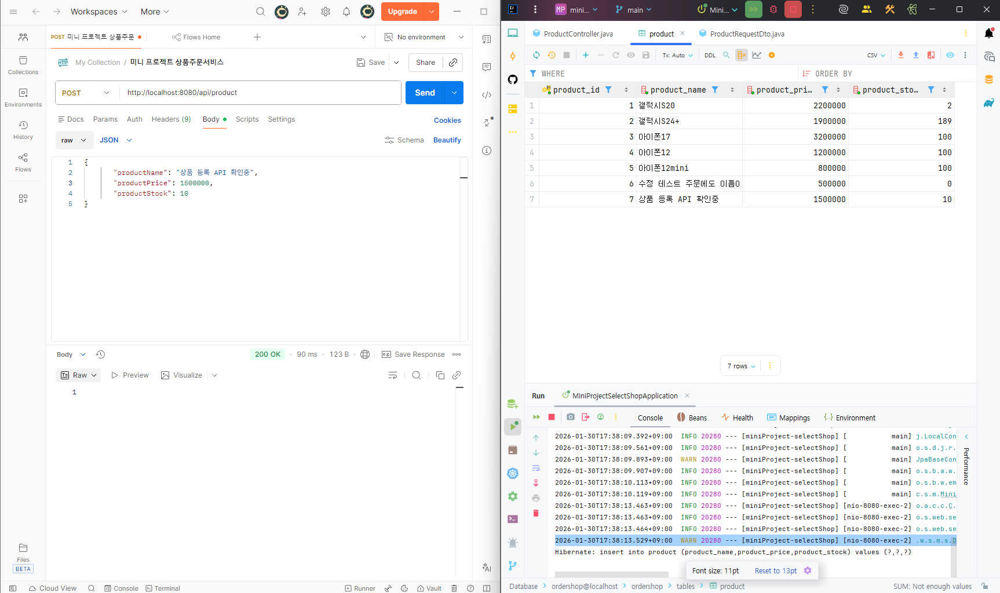

    상품 하나 조회 기능

    상품 전체 조회 기능

    상품 수정 기능
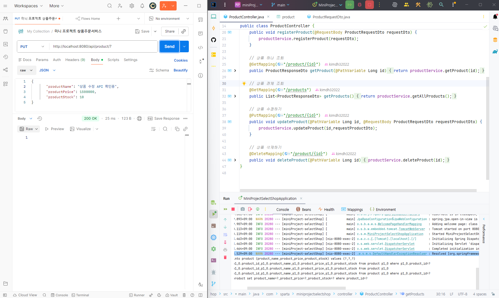

    상품 삭제 기능
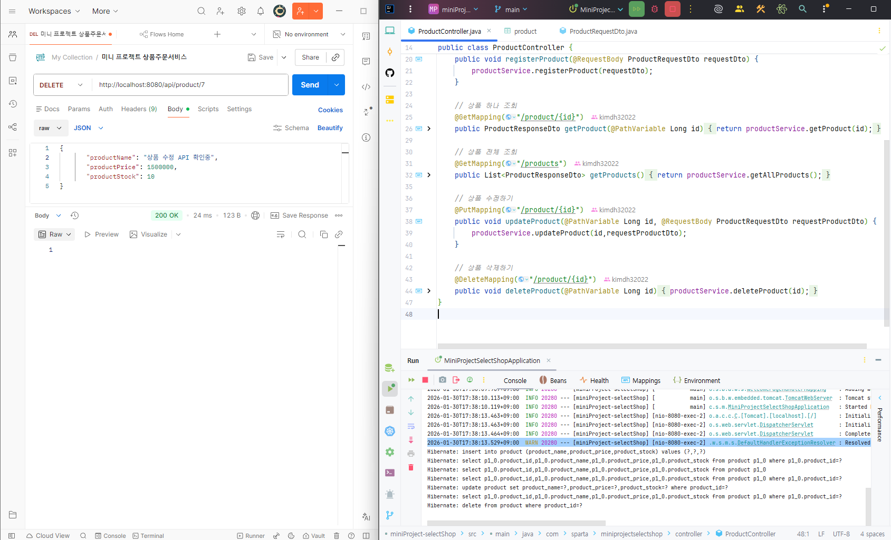

    주문 등록 기능
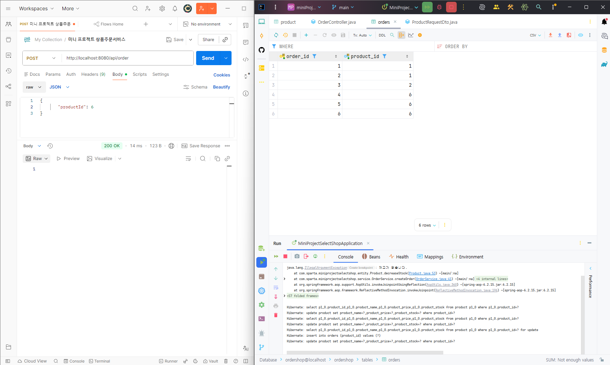

    주문 하나 조회 기능
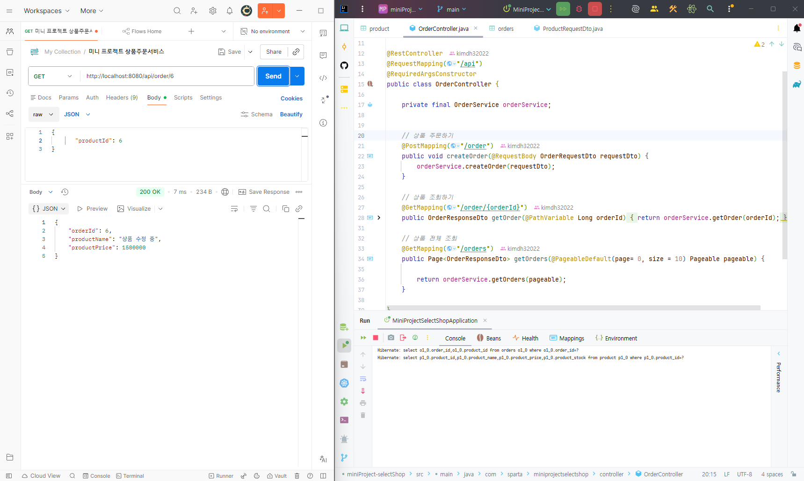

    상품 수정 시 주문 목록 수정 기능
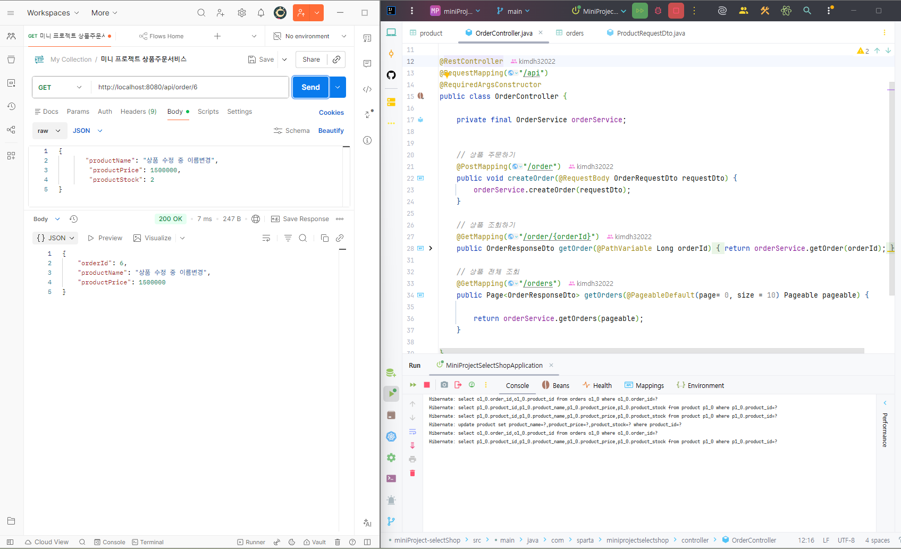

    주문 전체 조회 기능
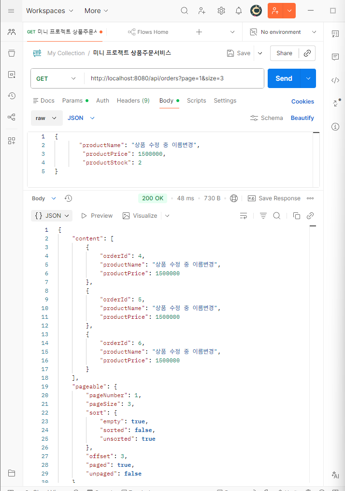

    주문 페이징 처리 및 N + 1 문제 @EntityGraph로 해결 
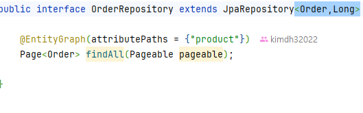

    N + 1 문제 결과 로그
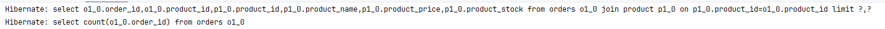

    상품 Stock(재고) 감소 (1)
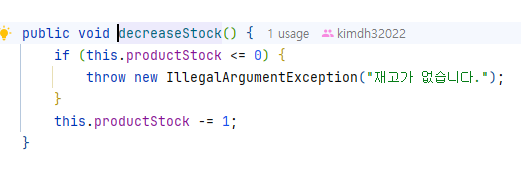

    상품 Stock(재고) 감소 (2)
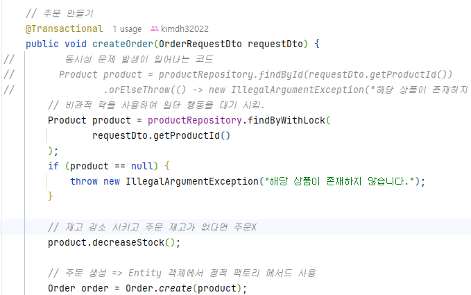

    동시성 상품 Stock(재고) 감소 문제 해결 코드
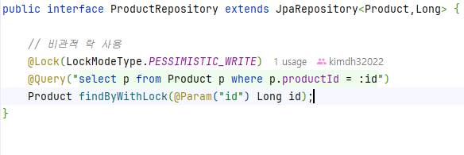